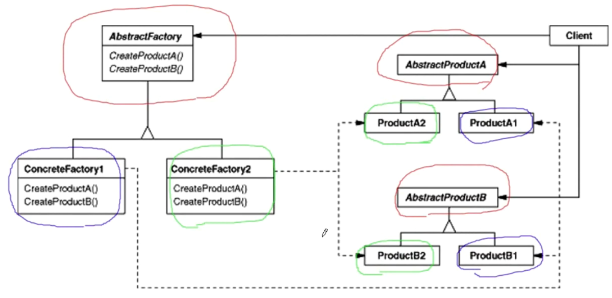

# 模式定义

提供一个接口，让该接口负责创建一系列“相关或者相互依赖的对象”，无需指定它们具体的类。

# 结构

# 要点总结

* 如果没有应对“多系列对象构建”的需求变化，则没有必要使用Abstract Factory模式，这时候使用简单的工厂完全可以。
* “系列对象”指的是在某一特定系列下的对象之间有相互依赖、或作用的关系。不同系列的对象之间不能相互依赖。
* Abstract Factory模式主要在于应对“新系列”的需求变动。其缺点在于难以应对“新对象”的需求变动。
