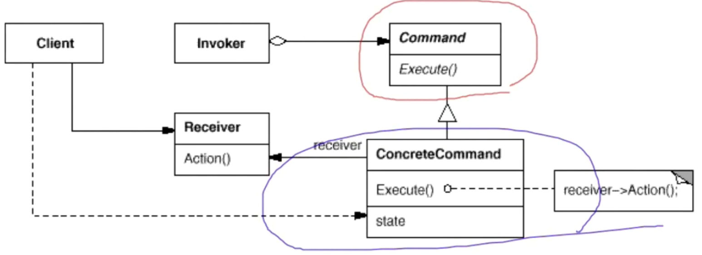

# 模式定义

将一个请求（行为）封装为一个对象，从而使你可用不同的请求对客户进行参数化；对请求排队或记录请求日志，以及支持可撤销的操作。

# 结构

# 要点总结

* Command模式的根本目的在于将"行为请求者"与"行为实现者"解耦，在面向对象语言中，常见的实现手段是"将行为抽象为对象"。
* 实现Command接口的具体命令对象ConcreteCommand有时候根据需要可能会保存一些额外的状态信息。通过使用Composite模式，可以将多个"命令"封装为一个"复合命令"MacroCommand。
* Command模式与C++中的函数对象有些类似。但两者定义行为接口的规范有所区别：Command以面向对象中的"接口-实现"来定义行为接口规范，更严格，但有性能损失；C++函数对象以函数签名来定义行为接口规范，更灵活，性能更高。
