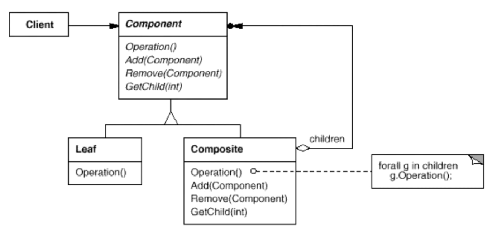

# 模式定义

将对象组合成树形结构以表示“部分-整体”的层次结构。Composite使得用户对单个对象和组合对象的使用具有一致性（稳定）。

# 结构

# 要点总结

* Composite模式采用树形结构来实现普遍存在的对象容器，从而将“一对多”的关系转化为“一对一”的关系，使得客户代码可以一致地（复用）处理对象和对象容器，无需关心处理的是单个的对象，还是组合的对象容器。
* 将“客户代码与复杂的对象容器结构”解耦是Composite的核心思想，解耦之后，客户代码将与纯粹的抽象接口——而非对象容器的内部实现结构——发生依赖，从而更能“应对变化”。
* Composite模式在具体实现中，可以让父对象中的子对象反向追溯；如果父对象有频繁的遍历需求，可使用缓存技巧来改善效率。
