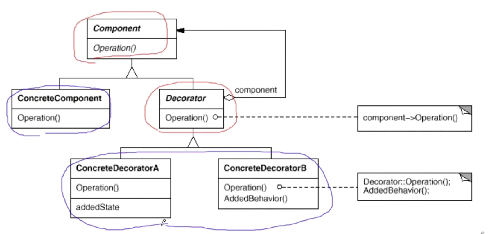

# 模式定义

动态（组合）地给一个对象增加一些额外的职责。就增加功能而言，Decorator模式比生成子类（继承）更为灵活（消除重复代码&减少子类个数）。

# 结构

# 要点总结

* 通过采用组合而非继承的手法，Decorator模式实现了在运行时动态扩展对象功能的能力，而且可以根据需要扩展多个功能。避免了使用继承带来的“灵活性差”和“多子类衍生问题”。
* Decorator类在接口上表现为is-a Component的继承关系，即Decorator类继承了Component类所具有的接口。但在实现上又表现为has-a Component的组合关系，即Decorator类又使用了另外一个Component类。
* Decorator模式的目的并非解决“多子类衍生的多继承”问题，Decorator模式应用的要点在于解决“主体类在多个方向上的扩展功能”——是为“装饰”的含义。
