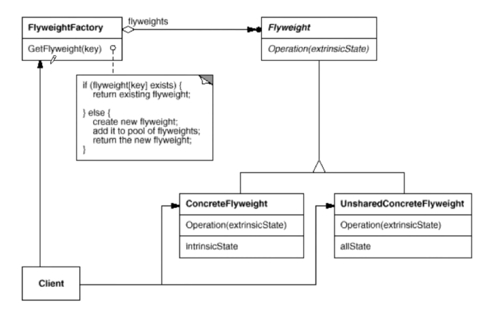

# 模式定义

运用共享技术有效地支持大量细粒度的对象。

# 结构

# 要点总结

* 面向对象很好地解决了抽象性的问题，但是作为一个运行在机器中的程序实体，我们需要考虑对象的代价问题。Flyweight主要解决面向对象的代价问题，一般不触及面向对象的抽象性问题。
* Flyweight采用对象共享的做法来降低系统中对象的个数，从而降低细粒度对象给系统带来的内存压力。在具体实现方面，要注意对象状态的处理。
* 对象的数量太大从而导致对象内存开销加大——什么样的数量才算大？这需要我们仔细的根据具体应用情况进行评估，而不能凭空臆断。
