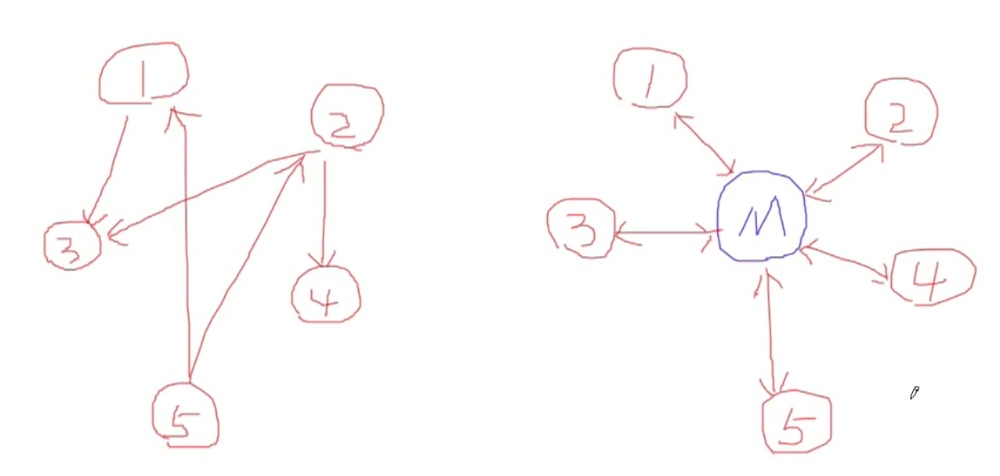

# 模式定义

用一个中介对象来封装（封装变化）一系列的对象交互。中介者使各对象不需要显式的相互引用（编译时依赖->运行时依赖），从而使其耦合松散（管理变化），而且可以独立地改变它们之间的交互。

# 结构

# 要点总结

* 将多个对象间复杂的关联关系解耦，Mediator模式将多个对象间的控制逻辑进行集中管理，变“多个对象互相关联”为“多个对象和一个中介者关联”，简化了系统的维护，抵御了可能的变化。
* 随着控制逻辑的复杂化，Mediator具体对象的实现可能相当复杂。这时候可以对Mediator对象进行分解处理。
* Façade模式是解耦系统间（单向）的对象关联关系；Mediator模式是解耦系统内各个对象之间（双向）的关联关系。
