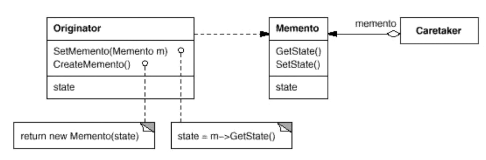

# 模式定义

在不破坏封装性的前提下，捕获一个对象的内部状态，并在该对象之外保存这个状态。这样以后就可以将该对象恢复到原先保存的状态。

# 结构

# 要点总结

* 备忘录（Memento）存储原发器（Originator）对象的内部状态，在需要时恢复原发器状态。
* Memento模式的核心是信息隐藏，即Originator需要向外界隐藏信息，保持其封装性。但同时又需要将状态保持到外界（Memento）。
* 由于现代语言运行时（如C#、Java等）都具有想当的对象序列化支持，因此往往采用效率较高、又较容易正确实现的序列化方案来实现Memento模式。
