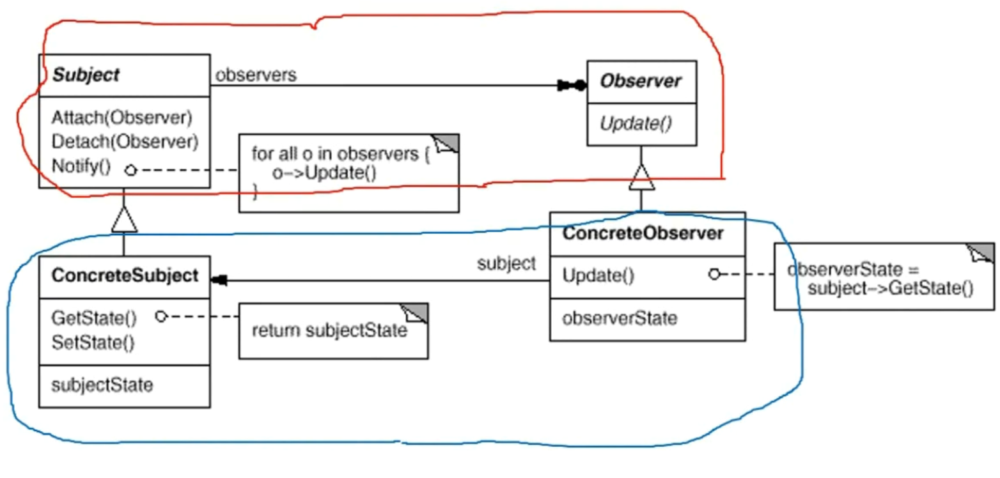

# 模式定义

定义对象间的一种一对多（变化）的依赖关系，以便当一个对象（Subject）的状态发生变化时，所有依赖于它的对象都得到通知并自动更新。

# 结构

# 要点总结

* 使用面向对象的抽象，Observer模式使得我们可以独立地改变目标与观察者，从而使二者之间的依赖关系达致松耦合。
* 目标发送通知时，无需指定观察者，通知（可以携带通知信息作为参数）会自动传播。
* 观察者自己决定是否需要订阅通知，目标对象对此一无所知。
* Observer模式是基于事件的UI框架中非常常用的设计模式，也是MVC模式的一个重要组成部分。
