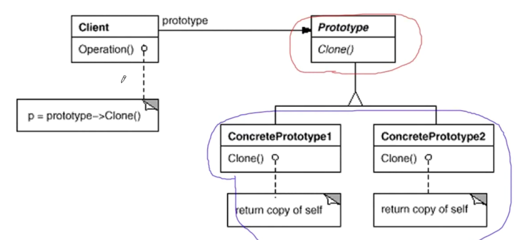

# 模式定义

使用原型实例指定创建对象的种类，然后通过拷贝这些原型来创建新的对象。

# 结构

# 要点总结

* Prototype模式同样用于隔离类对象的使用者和具体类型（易变类）之间的耦合关系，它同样要求这些“易变类”拥有“稳定的接口”。
* Prototype模式对于“如何创建易变类的实体对象”采用“原型克隆”的方法来做，它使得我们可以非常灵活地动态创建“拥有某些稳定接口”的新东西--所需工作仅仅是注册一个新类的对象（即原型），然后在任何需要的地方Clone。
* Prototype模式中的Clone方法可以利用某些框架中的序列化来实现深拷贝。
