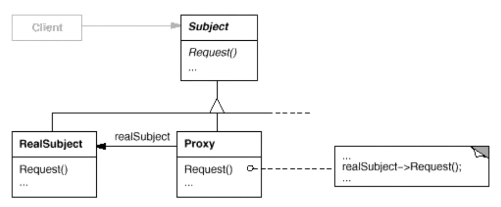

# 模式定义

为其他对象提供一种代理以控制（隔离，使用接口）对这个对象的访问。

# 结构

# 要点总结

* “增加一层间接层”是软件系统中对许多复杂问题的一种常见解决方法。在面向对象系统中，直接使用某些对象会带来很多问题，作为间接层的proxy对象便是解决这一问题的常用手法。
* 具体proxy设计模式的实现方法、实现粒度都相差很大，有些可能对单个对象做细粒度的控制，如copy-on-write技术，有些可能对组件模块提供抽象代理层，在架构层次对对象做proxy。
* Proxy并不一定要求保持接口完整的一致性，只要能够实现间接控制，有时候损及一些透明性是可以接受的。
