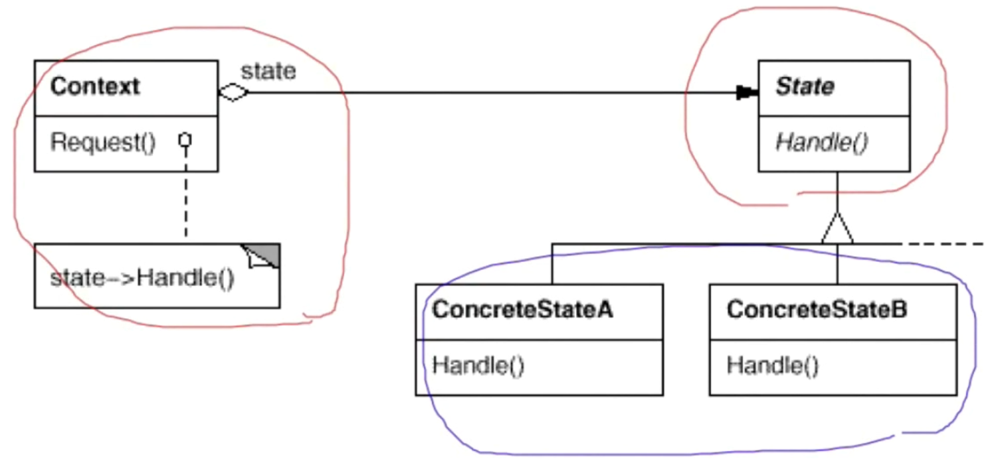

# 模式定义

允许一个对象在其内部状态改变时改变它的行为。从而使对象看起来似乎修改了其行为。

# 结构

# 要点总结

* State模式将所有与一个特定状态相关的行为都放入一个State的子类对象中，在对象状态切换时，切换相应的对象；但同时维持State的接口，这样实现了具体操作与状态转换之间的解耦。
* 为不同的状态引入不同的对象使得状态转换变得更加明确，而且可以保证不会出现状态不一致的情况，因为转换是原子性的——即要么彻底转换过来，要么不转换。
* 如果State对象没有实例变量，那么各个上下文可以共享同一个State对象，从而节省对象开销。
