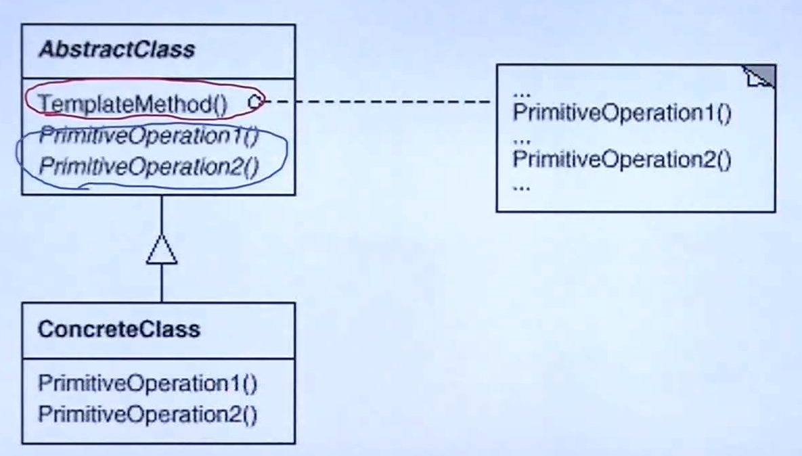

# 模式定义

定义一个操作中的算法的骨架（稳定），而将一些步骤延迟（变化）到子类中。Template Method使得子类可以不改变（复用）一个算法的结构即可重定义（override重写）该算法的某些特定步骤。

# 结构

# 要点总结

* Template Method模式是一种非常基础性的设计模式，在面向对象系统中有着大量的应用。它用最简洁的机制（虚函数的多态性）为很多应用程序框架提供了灵活的扩展点，是代码复用方面的基本实现结构。
* 除了可以灵活应对子步骤的变化外，“不要调用我，让我来调用你”的反向控制结构是Template Method的典型应用。
* 在具体实现方面，被Template Method调用的虚方法可以具有实现，也可以没有任何实现（抽象方法、纯虚方法），但一般推荐将它们设置为protected方法。
