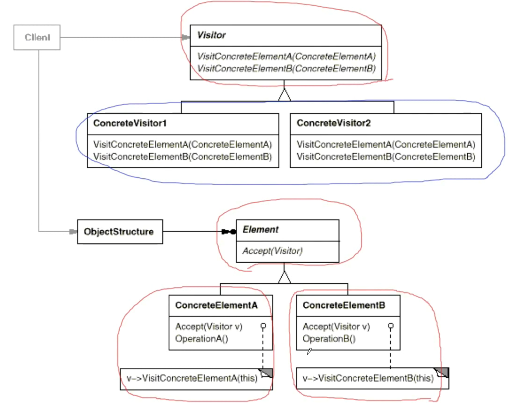

# 模式定义

表示一个作用于某对象结构中的各元素的操作。使得可以在不改变（稳定）各元素的类的前提下定义（扩展）作用于这些元素的新操作（变化）。

# 结构

# 要点总结

* Visitor模式通过所谓双重分发（doubledispatch）来实现在不更改（不添加新的操作-编译时）Element类层次结构的前提下，在运行时透明地为类层次结构上的各个类动态添加新的操作（支持变化）。
* 所谓双重分发即Visitor模式中间包括了两个动态分发（注意其中的多态机制）：第一个为accept方法的多态辨析；第二个为visitElementX方法的多态辨析。
* Visitor模式的最大缺点在于扩展类层次结构（增添新的Element子类），会导致Visitor类的改变。因此Visitor模式适用于“Element类层次结构稳定，而其中的操作却经常面临频繁改动”。
